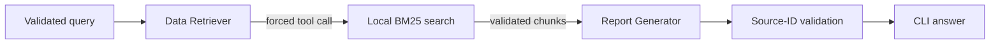

# Agentic Policy Assistant

A two-agent retrieval-augmented generation project for the AI Engineer programming test.
LangGraph orchestrates a forced-tool Data Retriever followed by a structured Report Generator.

> **Dataset status:** `knowledge_base.txt` is intentionally a placeholder. The final public policy
> source has not yet been selected. Automated tests use a clearly fictional fixture and do not make
> any OpenAI API calls.

## Why this design

- The Data Retriever must call one approved local BM25 tool and cannot answer directly.
- The Report Generator can use only validated retrieved chunks.
- Pydantic contracts validate every important agent boundary.
- Source IDs make grounding inspectable and reject invented citations.
- Retrieval tests are deterministic, offline, and free to run.



The retriever model can call only the local search tool. The report model receives the question and
validated evidence, but no tools. A final check rejects any source ID that retrieval did not return.

## Project structure

```text
agentic_rag/
├── agents.py       # agent prompts, search tool, and both bounded agents
├── cli.py          # command-line interface and dependency wiring
├── config.py       # environment-backed settings
├── models.py       # Pydantic contracts
├── retrieval.py    # loading, preprocessing, and BM25 search
└── workflow.py     # two-step LangGraph workflow
tests/              # offline unit and workflow tests
evals/cases.json    # small reviewer-readable evaluation set
main.py             # executable entry point
```

The layout is intentionally compact. Modules are split by responsibility rather than by individual
class, which keeps the project easy to review without removing its production-minded boundaries.

## Requirements

- Python 3.11+
- An OpenAI API key for live CLI runs

## Setup

```powershell
python -m venv .venv
.\.venv\Scripts\Activate.ps1
python -m pip install -r requirements-dev.txt
Copy-Item .env.example .env
```

Set `OPENAI_API_KEY` in `.env`. Never commit `.env`.

Before a live run, replace the placeholder `knowledge_base.txt` with blank-line-separated chunks:

```text
[POLICY-001: SHORT TITLE]
One self-contained policy paragraph.

[POLICY-002: ANOTHER TITLE]
Another self-contained policy paragraph.
```

## Run

```powershell
python main.py "What approval is required for international travel?"
python main.py "What approval is required for international travel?" --show-sources
python main.py --interactive --show-sources
```

## Verify

```powershell
ruff check .
ruff format --check .
pytest
pytest --cov --cov-report=term-missing
```

The normal test suite uses test doubles for both agents and never invokes OpenAI. Live evaluations
must remain explicit and opt-in.

## Trust boundaries

- The API key is read from environment configuration and never added to prompts or logs.
- Knowledge-base content is treated as data, not executable instructions.
- Retrieval is local, deterministic, and testable without an LLM.
- Pydantic validates inputs and outputs; explicit source checks guard against invented citations.

## Current limitations

- The included tokenizer targets an English demonstration corpus.
- BM25 is lexical retrieval, not embedding-based semantic search.
- The application reads one local UTF-8 text file and does not persist conversations.
- Pydantic validates structure; grounding checks and evaluations are still required for factuality.
